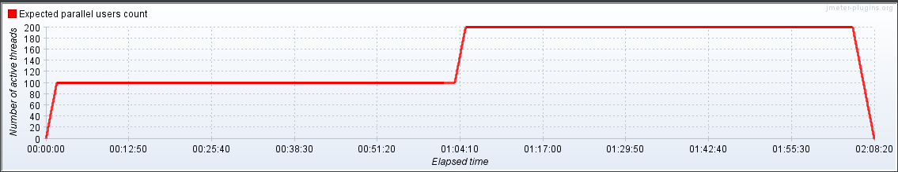

# Load Test

## Introduction:
This repo contains sample load test scripts along with dockerized env set up


## Functional Scenarios:
**Explain Functional scenarios**


# Environment set up and test execution
## Manual set up :
**Requires Java 8+**  
- Download Jmeter binaries from
[Jmeter.apache.org](http://jmeter.apache.org/download_jmeter.cgi)  
- Unzip and set path


### Add Plugins

Download plugins-manager.jar
[Jmeter-plugins-manager.jar](https://jmeter-plugins.org/install/Install/)  
and put it into lib/ext directory, then restart JMeter.

Go to Options->Plugins Manager in Jmeter GUI and add below plugins  
- Custom Thread Groups
- PerfMon
- Variables from CSV File  

Or Download above plugins jars and place it in lib/ext directory of Jmeter binaries.

### Run Load Test in non Gui mode  
Load Test scripts are written with one step incremental scenarios for handling concurrent users.  
Refer below example graph to understand one-step incremental load test scenario
- Example graph of load test sceanrio   


- **Specify all parameters for load test scenarios in udv.csv**      

- **command to execute test manually**

```
jmeter -Jusername=<give username> -Jpassword=<give password> -Jvariables_from_csv_file=<file path to udv.csv> -Jerror_log_file=<path to generate response data xml file> -n -t <file path to jmeter script **.jmx>   
-l <file path to generate reports in jtl or csv> -e -o <folder path to generate html reports>

```

## Use of Dockerized environment :  
### 1. clone git repo : API Performance Testing
### 2. Build Docker image
```
cd API Performance Testing/microservice1
docker build -t jmeter .
```
### 3. Run load test in docker container   
- **Provide volume path from host in run.sh script**    
- **Specify all parameters for load test scenarios in udv.csv**  

**Example data in udv.csv:** 

| variables                   | time in sec | Description |       
| --------------------------  | ------------- | ------------ |       
| env                         | staging  | Select env on which you want to run the test |  
| calledid                    | tdup_sv_further | Select module for test |    
| initial_threads             | 1  | Select number of concurrent users that you want to start with  |   
| initial_threads_ramp_up     | 1  | Time in which all the initial concurrent users are up |  
| initial_threads_duration    | 30 | The durstion of time you want to run the test for initial set of concurrent users  |  
| initial_threads_ramp_down   | 1  | Time in which all the initial concurrent users are down |  
| final_threads               | 5  | Select number of concurrent users that you want to start after final_threads_initial_delay |  
| final_threads_ramp_up       | 5  | Time in which all the second set of concurrent users are up |   
| final_threads_duration      | 30 | The durstion of time you want to run the test for second set of concurrent users |  
| final_threads_ramp_down     | 2  | Time in which all the second set of concurrent users are down |  
| final_threads_initial_delay | 30 | Time that you want second set of threads to wait  |      
| starting_session_id         | 9000 | session ids are auto incremented from starting session id  |   

### Run Test
```
cd API Performance Testing/microservice1
./run.sh
```

# Directory Tree structure
```
API Performance Testing/

```